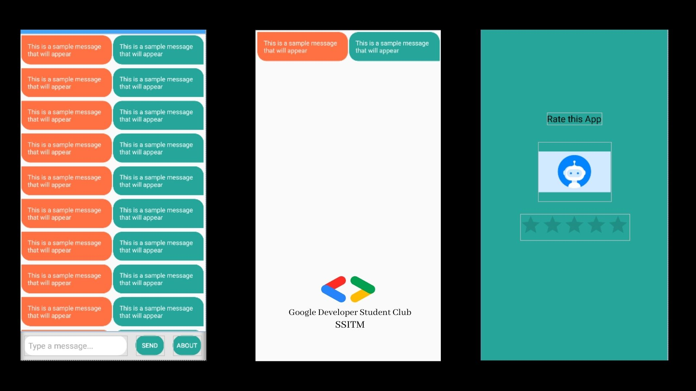

# Android-Study-Jams

College Doubtclearing app 

<b> Problem Statement: </b>

Over a period period of time, many issues have been faced by our students regarding the doubt solving issues. The most difficult situation they face while solving some question and if they got stuck some where & most importantly for guidence. One of them is the huge time taken for calling and asking doubt with others.
Technology plays a vital role in day-to-day life activities which in turn made great changes in many work fields and out of them Mobile Application is one of the major developments. Mobile Application can be used effectively for this job as they are widely used and are known for easy access.

<b> Proposed Solution : </b>

This project proposes a “automate Chat bot” to response the students there doubts and help them in more efficient manner digitally. Its features include responsing and suggestining resources within a sec according to the availability as a mentor . For now this app is build by a beginners and has a basic functionalities . It is hard coded so, for now it is not ready for users . Currently the app works for SSITM institute only. The project's scope is to extend it for other institutions for guidence and as an intelligent helping bot.

    	  	
<b> Functionality & Concepts used : </b>

- The App has a very simple and interactive interface which helps the students select their route bus and track its location. Following are few android concepts used to achieve the functionalities in app : 
- Constraint Layout : Most of the activities in the app uses a flexible constraint layout, which is easy to handle for different screen sizes.
- Simple & Easy Views Design : Use of familiar audience EditText with hints and interactive buttons made it easier for students to register or sign in without providing any detailed instructions pages. Apps also uses App Navigation to switch between different screens.
- RecyclerView : To present the list of different route busses we used the efficient recyclerview.
Google Maps API : We are also using the Google Maps API free version for  below 1000 users. In future if the user base increases we will go for the upgraded plan too.
- LiveData & Room Database : We are also using LiveData to update & observe any changes in the Bus driver's locations received from their mobile at real time and update it to local databases using Room. Coordinates are then updated in the bus route screen and students can track their route bus locations.

<b> Application Link & Future Scope : </b>

The app is currently in the Alpha testing phase with GNITS institute with a limited no. of users, You can access the app : [YOUR APP LINK HERE](either Github link or Google Play store link of published app or .apk file).

Once the app is fully tested and functional in GNITS institute, we plan to talk to neighboring colleges also to propose this app idea and collaborate with them on this transportation service. We aim that by next year most of the colleges in our district will use Bus tracking apps to check out their bus routes and be informed all the time. Also we are planning to include emergency SOS features for students traveling in busses if they are stuck somewhere. 
